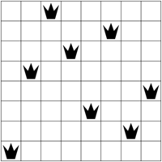
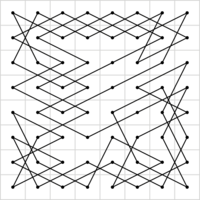

# CLP(FD) &mdash; Constraint Logic Programming over Finite Domains

CLP(FD), Constraint Logic Programming over Finite Domains, is
available in SWI-Prolog as
[**library(clpfd)**](http://www.swi-prolog.org/man/clpfd.html).

This repository contains usage examples and tests of the library.

[**clpfd.pdf**](clpfd.pdf) is a _shortened version_ of the library
documentation, intended as supplementary lecture material.

## Using CLP(FD) constraints

CLP(FD) is an instance of the general CLP(.) scheme, extending logic
programming with reasoning over specialised domains.

In the case of CLP(FD), the domain is the set of _integers_.

CLP(FD) constraints like
[`(#=)/2`](http://www.swi-prolog.org/pldoc/doc_for?object=%23%3D%20/%202),
[`(#\=)/2`](http://www.swi-prolog.org/pldoc/doc_for?object=%23%5C%3D%20/%202),
and
[`(#<)/2`](http://www.swi-prolog.org/pldoc/doc_for?object=%23%3C%20/%202)
are meant to be used as pure alternatives for lower-level arithmetic
primitives over integers. Importantly, they can be used in *all
directions*.

For example, we can use CLP(FD) constraints to obtain a version of
`n_factorial/2` that can be used as a true relation:

    :- use_module(library(clpfd)).

    n_factorial(0, 1).
    n_factorial(N, F) :-
            N #> 0,
            N1 #= N - 1,
            F #= N * F1,
            n_factorial(N1, F1).

This works in all directions, for example:

    ?- n_factorial(47, F).
    258623241511168180642964355153611979969197632389120000000000 ;
    false.

and also:

    ?- n_factorial(N, 1).
    N = 0 ;
    N = 1 ;
    false.

and also in the most general case:

    ?- n_factorial(N, F).
    N = 0,
    F = 1 ;
    N = F, F = 1 ;
    N = F, F = 2 ;
    N = 3,
    F = 6 .

## Example programs

This repository contains several example programs. The main predicates
are all completely pure and can be used as true relations.

To get an idea of the power, usefulness and scope of CLP(FD)
constraints, I recommend you work through the examples in the
following order:

1. [**n_factorial.pl**](n_factorial.pl): Shows how to use CLP(FD)
   constraints for **declarative integer arithmetic**, obtaining very
   general programs that can be used in all directions. Declarative
   integer arithmetic is the simplest and most common use of CLP(FD)
   constraints. They are easy to understand and use this way, and
   often increase generality and logical purity of your code.

2. [**sendmory.pl**](sendmory.pl): A simple cryptoarithmetic puzzle.
   The task is to assign one of the digits 0,...,9 to each of the
   letters S,E,N,D,M,O,R and Y in such a way that the following
   calculation is valid, and no leading zeroes appear:

            S E N D
          + M O R E
          ---------
        = M O N E Y

   This example illustrates several very important concepts:

   * It is the first example that shows **residual constraints** for the
     most general query. They are equivalent to the original query.

   * It is good practice to separate the **core relation** from
     `labeling/2`. See the [CLP(FD)
     documentation](http://www.swi-prolog.org/man/clpfd.html) for more
     information about this subject.

   * You can use this example to illustrate that the CLP(FD) system is able
     to **propagate** many things that can also be found with human
     reasoning. For example, due to the nature of the above calculation and
     the prohibition of leading zeroes, `M` is necessarily 1.

3. [**sudoku.pl**](sudoku.pl): Uses CLP(FD) constraints to model and solve
   a simple and well-known puzzle. This example is well suited for
   understanding the impact of different **propagation strengths**: Use it
   to compare
   [`all_different/1`](http://www.swi-prolog.org/pldoc/man?predicate=all_different/1)
   and
   [`all_distinct/1`](http://www.swi-prolog.org/pldoc/man?predicate=all_distinct/1)
   on different puzzles:

    

   The small dots in each cell indicate how many elements are pruned
   by different **consistency techniques**. In many Sudoku puzzles,
   using `all_distinct/1` makes labeling unnecessary. Does this mean that
   we can forget `all_different/1` entirely?

4. [**magic_square.pl**](magic_square.pl): CLP(FD) formulation of [*magic
   squares*](http://mathworld.wolfram.com/MagicSquare.html). This is a good
   example to learn about **symmetry breaking** constraints: Consider how
   you can eliminate solutions that are rotations, reflections etc. of
   other solutions, by imposing suitable further constraints. For example,
   the following two solutions are essentially identical, since one can be
   obtained from the other by reflecting elements along the main diagonal:

    

   Can you impose additional constraints so that you get only a single
   solution in such cases, without losing any solutions that do not
   belong to the same equivalence class? How many solutions are there
   for N=4 that are unique up to isomorphism?

5. [**magic_hexagon.pl**](magic_hexagon.pl): Uses CLP(FD) to describe a
   [*magic hexagon*](http://mathworld.wolfram.com/MagicHexagon.html) of
   order 3. The task is to place the integers 1,...,19 in the following
   grid so that the sum of all numbers in a straight line (there are lines
   of length 3, 4 and 5) is equal to 38. One solution of this task is shown
   in the right picture:

    

   This is an example of a task that looks very simple at first, yet
   is almost impossibly hard to solve manually. It is easy to solve
   with CLP(FD) constraints though. Use the constraint solver to show
   that the solution of this task is unique up to isomorphism.

6. [**n_queens.pl**](n_queens.pl): Model the so-called [*N-queens
   puzzle*](https://en.wikipedia.org/wiki/Eight_queens_puzzle) with CLP(FD)
   constraints. This example is a good candidate to experiment with
   different **search strategies**, specified as options of
   [`labeling/2`](http://www.swi-prolog.org/pldoc/man?predicate=labeling/2).
   For example, using the labeling strategy `ff`, you can easliy find
   solutions for 100 queens and more. Sample solutions for 8 and 50 queens:

    

   Try to find solutions for larger N. Reorder the variables so that
   `ff` breaks ties by selecting more central variables first.

7. [**knight_tour.pl**](knight_tour.pl): Closed Knight's Tour using CLP(FD)
   constraints. This is an example of using a more complex **global
   constraint** called
   [`circuit/1`](http://www.swi-prolog.org/pldoc/man?predicate=circuit/1).
   It shows how a problem can be transformed so that it can be expressed
   with a global constraint. Sample solutions, using an 8x8 and a 16x16
   board:

    

   Decide whether `circuit/1` can also be used to model tours that are
   not necessarily closed. If not, why not? If possible, do it.

## Animations

When studying Prolog and CLP(FD) constraints, it is often very useful
to show *animations* of search processes. An instructional example:

[**N-queens animation**](http://www.metalevel.at/queens/): This
visualizes the search process for the N-queens example.

You can use similar PostScript instructions to create [custom
animations](http://www.metalevel.at/postscript/animations.html) for
other examples.

## Propagation strength of CLP(FD) constraints

Since integer arithmetic is in general *undecidable*, CLP(FD)
constraints are necessarily *incomplete*. This means that you cannot,
in general, take the fact that a CLP(FD) constraint *succeeds* as an
indication that there are any solutions. Therefore, you need to use
[`call_residue_vars/2`](http://www.swi-prolog.org/pldoc/man?predicate=call_residue_vars/2)
to see if any constraints are still pending. For example:

    :- use_module(library(clpfd)).

    declarative_false :-
            X #< Y,
            Y #< X.

With the above program, we get:

    ?- declarative_false.
    true.

however, it is in fact `false`, because there are no solutions! The
toplevel has omitted important constraints that are still pending. You
can make them visible by wrapping the goal in `call_residue_vars/2`:

    ?- call_residue_vars(declarative_false, Vs).
    Vs = [X1, X2],
    X1#=<X2+ -1,
    X2#=<X1+ -1.

There is a solution only if you can satisfy these residual goals.

## SICStus compatibility

With SWI-Prolog's `library(clpfd)`, I am generally aiming for API
compatibility with SICStus Prolog. Therefore, all examples work with
at most small changes with SICStus Prolog too. For example, instead of
`(ins)/2`, you need to use `domain/3` in SICStus Prolog.

For better performance and many more specialised constraints, I highly
recommend you obtain a copy of SICStus Prolog, and use it to solve
more serious tasks with CLP(FD).

## An impure alternative: Low-level integer arithmetic

Suppose for a moment that CLP(FD) constraints were not available in
your Prolog system, or that you do not want to use them. How do we
formulate `n_factorial/2` with more primitive integer arithmetic?

In our first attempt, we simply replace the declarative CLP(FD)
constraints by lower-level arithmetic predicates and obtain:

    n_factorial(0, 1).
    n_factorial(N, F) :-
            N > 0,
            N1 is N - 1,
            F is N * F1,
            n_factorial(N1, F1).

Unfortunately, this does not work at all, because lower-level
arithmetic predicates are *moded*: This means that their arguments
must be sufficiently instantiated. In fact, SWI-Prolog does not even
compile the above code but yields an error at compilation time.
Therefore, we must reorder the goals and&nbsp;&mdash; somewhat
annoyingly&nbsp;&mdash; change this for example to:

    n_factorial(0, 1).
    n_factorial(N, F) :-
            N > 0,
            N1 is N - 1,
            n_factorial(N1, F1),
            F is N * F1.

Naive example queries inspired more by *functional* than by
*relational* thinking may easily mislead us into believing that this
version is working correctly:

    ?- n_factorial(6, F).
    F = 720 ;
    false.

Another example:

    ?- n_factorial(3, F).
    F = 6 ;
    false.

But what about *more general* queries? For example:

    ?- n_factorial(N, F).
    N = 0,
    F = 1 ;
    ERROR: n_factorial/2: Arguments are not sufficiently instantiated

Unfortunately, this version thus cannot be used to enumerate more than
one solution, which is another severe drawback in comparison with the
pure version.

You can make the deficiency a lot worse by arbitrarily adding
a&nbsp;`!/0` somewhere. Using `!/0` is a quite reliable way to destroy
almost all declarative properties of your code in most cases, and this
example is no exception:

    n_factorial(0, 1) :- !.
    n_factorial(N, F) :-
            N > 0,
            N1 is N - 1,
            n_factorial(N1, F1),
            F is N * F1.

This version appears in several places. The fact that the following
interaction *incorrectly* tells us that there is exactly one solution of
the factorial relation is apparently no cause for concern there:

    ?- n_factorial(N, F).
    N = 0,
    F = 1.

Zero and one are the only important integers in any case, if you are
mostly interested in programming at a very low level.

For more usable and general programs, I therefore recommend you stick
to CLP(FD) constraints for integer arithmetic. You can place pure
goals in any order without changing the declarative meaning of your
program, just as you would expect from logical conjunction. For
example:

    :- use_module(library(clpfd)).

    n_factorial(0, 1).
    n_factorial(N, F) :-
            N #> 0,
            N1 #= N - 1,
            n_factorial(N1, F1),
            F #= N * F1.

Reordering pure goals can change **termination properties**, but it
cannot incorrectly lead to failure where there is in fact a solution.
Therefore, we get with the above CLP(FD) version for example:

    ?- n_factorial(N, 3).
    <loops>

And now we can reason completely declaratively about the code: Knowing
that (a)&nbsp;CLP(FD) constraints are *pure* and can thus be reordered
quite liberally and (b)&nbsp;that posting CLP(FD) constraints *always
terminates*, we *know* that placing CLP(FD) constraints earlier can at
most *improve*, never *worsen* the desirable termination properties.

Such is the power of staying pure.

## Acknowledgments

I am extremely grateful to:

[**Jan Wielemaker**](http://www.swi-prolog.org) for providing the
Prolog system that made all this possible in the first place.

[**Tom Schrijvers**](http://people.cs.kuleuven.be/~tom.schrijvers/),
who has generously contributed several important constraint libraries
to SWI-Prolog
([`dif/2`](http://www.swi-prolog.org/pldoc/man?predicate=dif/2)!!),
and from whom I learned a lot.

[**Ulrich Neumerkel**](http://www.complang.tuwien.ac.at/ulrich/), who
introduced me to constraint logic programming and was the first and
most determined tester of my library, filing hundreds of comments. If
you are teaching Prolog, I recommend you check out his [GUPU
system](http://www.complang.tuwien.ac.at/ulrich/gupu/).

[**Nysret Musliu**](http://dbai.tuwien.ac.at/staff/musliu/), my thesis
advisor, whose interest in combinatorial tasks and constraint
satisfaction highly motivated me to work in this area.

[**Mats Carlsson**](https://www.sics.se/~matsc/), the designer and main
implementor of SICStus Prolog and its superb [CLP(FD)
library](https://sicstus.sics.se/sicstus/docs/latest4/html/sicstus.html/lib_002dclpfd.html#lib_002dclpfd).
For any serious use of CLP(FD) constraints, make sure to check out his
elegant and fast system.
